# Lab: Secure Cloud Bastion & SIEM Detection Pipeline

**Cloud:** Vultr (VPS & VPC) | **OS:** Windows Server 2022 | **Security Stack:** WireGuard, Sysmon, Wazuh
**Focus:** Perimeter Hardening, Detection Engineering, and Adversarial Emulation

* **The Bastion (Windows Server 2022):** * Secured via **WireGuard VPN** (No public RDP).
    * Acting as a jump box to the internal network.
* **The Pipeline (Sysmon + Wazuh Agent):**
    * Configured **Sysmon** on the Windows host to capture granular process and network events.
    * Installed the **Wazuh Agent**, configured to ship logs over the **Vultr Private VPC** to the manager.
* **The SIEM (Wazuh Manager):**
    * Fully isolated on a separate Vultr instance with **no public IP**.
    * Only accessible via the Windows Bastion or the private internal network.

## 1. Executive Summary & Architectural Strategy
This lab demonstrates the transition from a standard cloud-hosted server to a hardened **Bastion Host** architecture. The core objective was to secure a **Wazuh SIEM Manager** by removing all public-facing interfaces and tunneling all management and telemetry traffic through a secure, single-port entry point.

### The Problem
Managing a SIEM in the cloud often leads to "Firewall Rule Bloat"—constantly whitelisting new public IPs for different admins and remote agents. This increases the attack surface and operational overhead.

### Evolution of Access Control
1. **Initial State:** Windows Server RDP (3389) was open to the internet but restricted via Cloud Firewall IP whitelisting. 
2. **Hardened State:** RDP was fully blocked at the network edge. **WireGuard VPN** was implemented as the sole encrypted gateway for administrative access.
3. **Zero-Exposure VPC:** Migrated the Wazuh Manager to a **Private VPC** with no public IP, reachable only via the WireGuard tunnel on the Bastion.

### The Solution: "Zero-Exposure" VPC Model
* **Hardened Perimeter:** The Vultr Cloud Firewall was stripped down to a **single UDP port** for WireGuard.
* **Network Segmentation:** Migrated the Wazuh Manager to a **Private VPC**. It has no public IP address, making it invisible to external scanners and automated exploit attempts.
* **Secure Access:** Administrative RDP access and Wazuh telemetry (Sysmon) are routed exclusively through a **WireGuard VPN** and the internal 10.x.x.x network.

## 2. Infrastructure & Engineering Log
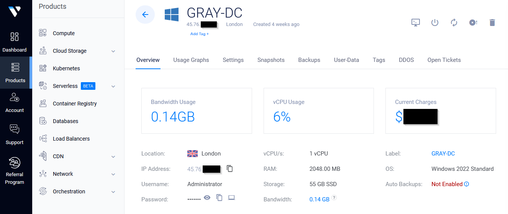
*Vultr instance `GRAY-DC` acting as the secure gateway in the London region.*

### 🛠️ Troubleshooting: The WireGuard Port Migration
Establishing a stable VPN connection required resolving dynamic port conflicts within the Windows environment. 

**Port History & Conflict Resolution:**
* **Phase 1 (Port 51820):** Initial deployment on the WireGuard default port.
* **Phase 2 (Port 61999):** Migrated due to local network testing; worked until a system restart.
* **The Conflict:** Upon reboot, the **Windows DNS Service** dynamically claimed port 61999, preventing the WireGuard service from binding to the interface.
* **The Final Fix (Port 55555):** I remapped WireGuard to a dedicated high-range port (**55555**) and configured a **DNS Port Exclusion** to reserve this range, ensuring permanent service availability.

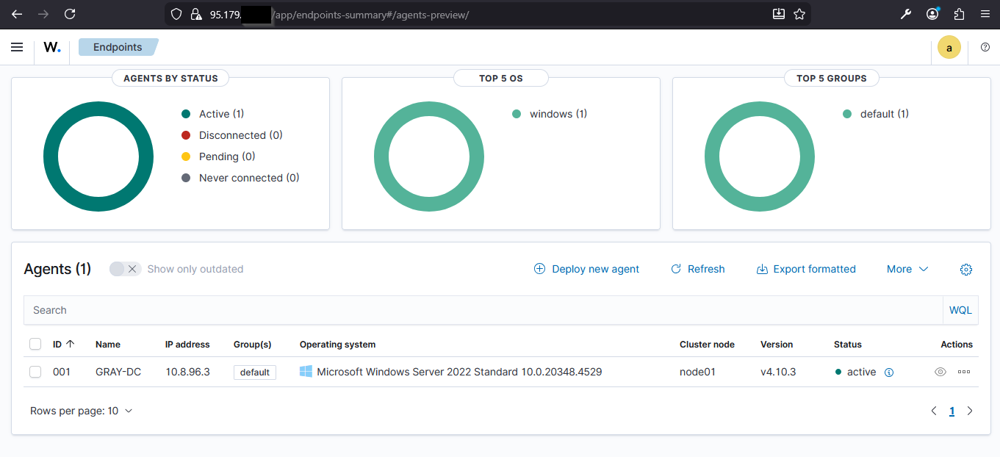

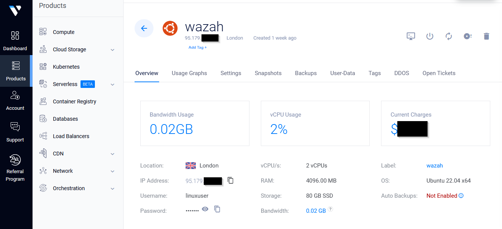

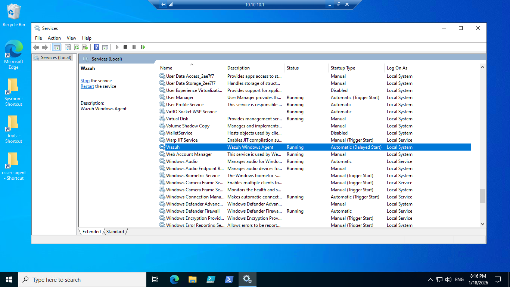

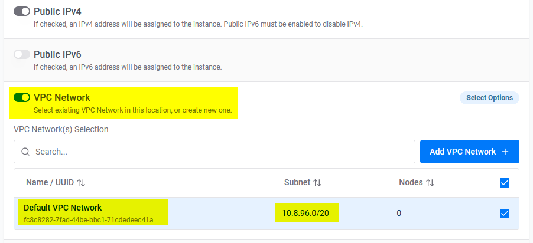

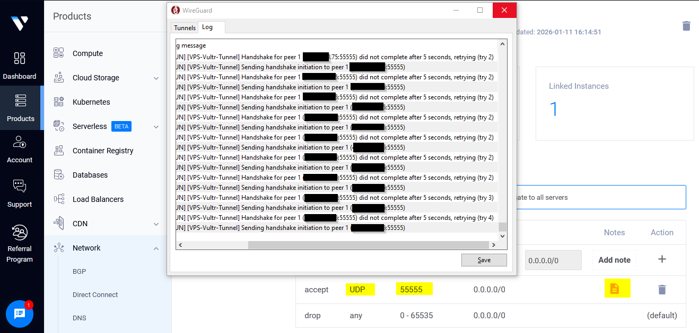

## Cloud Hardening
The environment was provisioned using **Vultr** to simulate a publicly reachable asset. To reduce the attack surface, I implemented:
* **WireGuard VPN:** The only entry point for administrative access.
* **Vultr VPC:** Internal private networking used for log shipping to the Wazuh Manager.
* **Host Isolation:** RDP (3389) is blocked at the firewall and only accessible via the internal VPN interface.

### 🛠️ Real-World Troubleshooting: Port Conflict Resolution
During the implementation of the WireGuard tunnel, I encountered a critical service failure:
* **Incident:** After a server reboot, the WireGuard service failed to initialize on its original port (`61999`).
* **Root Cause Analysis:** Using `netstat`, I identified that the **Windows DNS service** had dynamically claimed the port during startup.
* **Remediation:** I performed a port conflict analysis and remapped WireGuard to a dedicated high-range port, ensuring service persistence and eliminating future overlaps with system services.

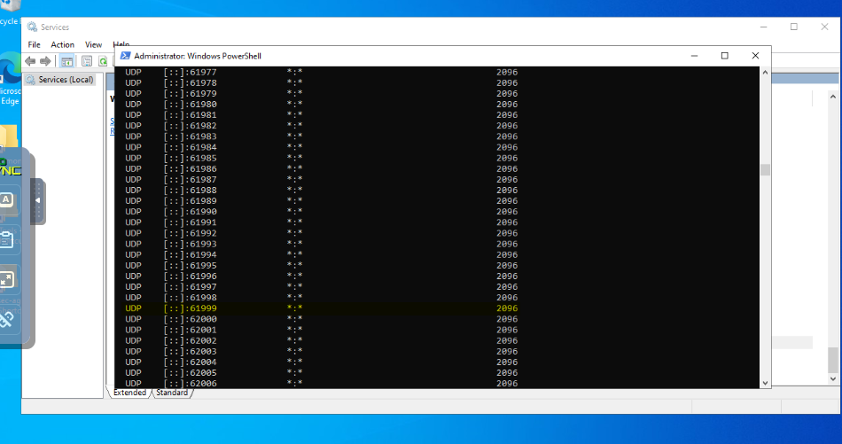

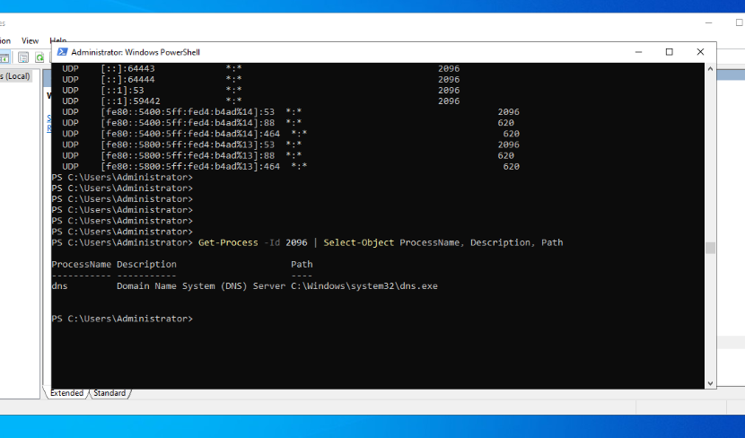

Using `Get-Process` to identify that the Windows DNS Service (dns.exe) had dynamically occupied the required UDP ports.

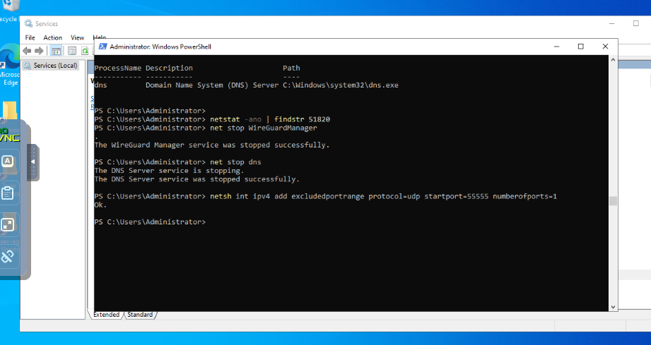
*Executing the `netsh int ipv4 add excludedportrange` command to reserve port 55555 for the VPN gateway.*

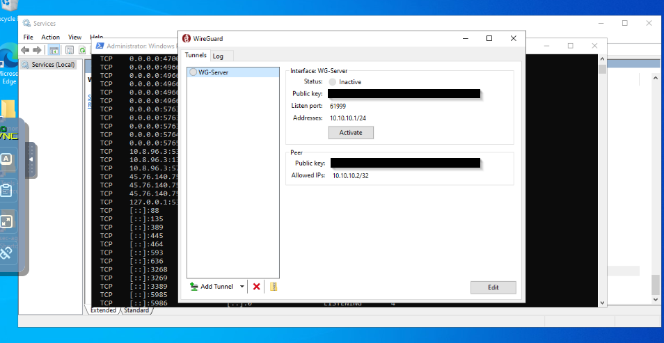

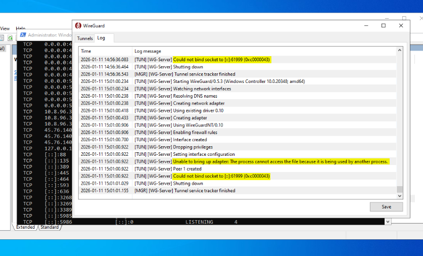

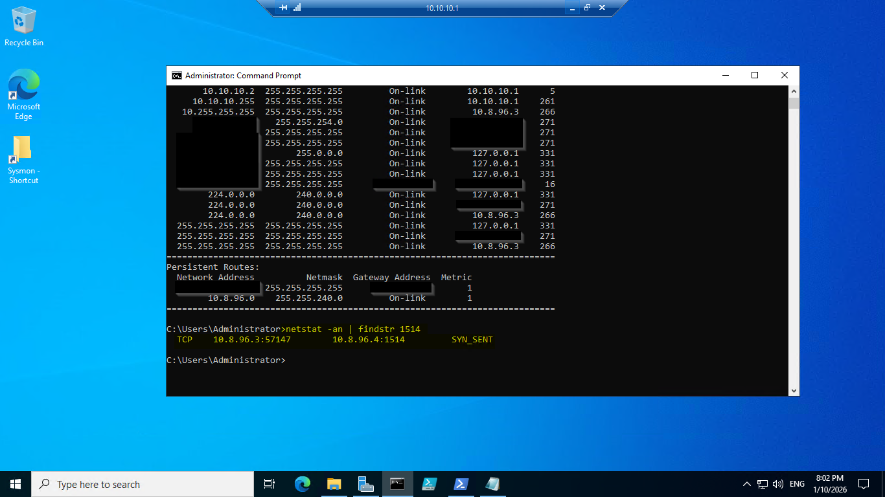

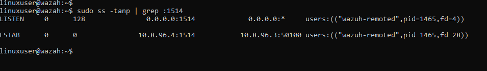

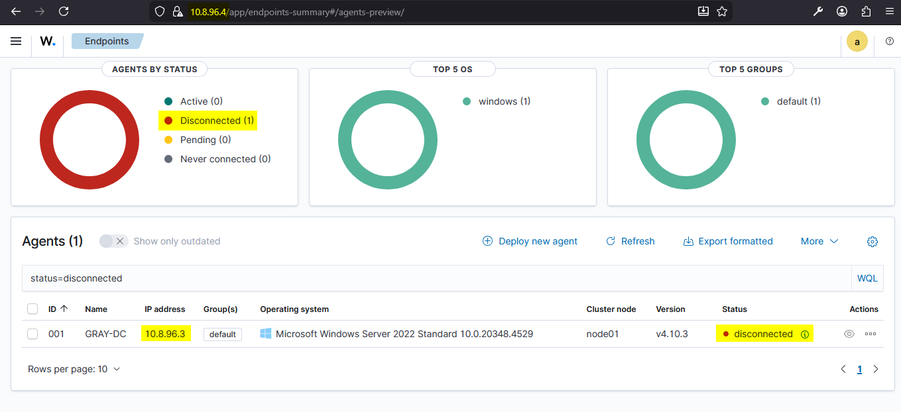

* **Result:** The Wazuh Manager now has **zero public exposure**. All agent communication (Sysmon logs) and administrative access happen exclusively over the 10.x.x.x internal network.

## 3. Adversarial Emulation: Mimikatz
To verify the integrity of the detection pipeline over the private VPC, I performed an emulation of **MITRE ATT&CK T1003 (OS Credential Dumping)**.

### Attack Scenario: OS Credential Dumping
* **Technique:** [MITRE ATT&CK T1003 (OS Credential Dumping)](https://attack.mitre.org/techniques/T1003/)
* **Execution:** Executed **Mimikatz** (`lsadump::sam`) on the Windows Server 2022 instance to attempt local SAM hash extraction.
* **The Goal:** To trigger a high-fidelity alert in Wazuh and verify that the Sysmon telemetry was correctly mapped.

*Executing Mimikatz on the Windows Bastion to attempt SAM hash extraction.*

## Detection Engineering & SIEM Tuning
* **The Pipeline:** Windows Server 2022 → Sysmon → Wazuh Agent → **Private VPC** → Wazuh Manager.
* **Manual Tuning:** I customized the `ossec` rules on the Wazuh manager to escalate this behavior to **Level 15 (Extremely High Severity)**.
* **The Rationale:** In a production environment, credential dumping is a "critical stop" event. By increasing the severity from the default, I ensured that this alert stands out from lower-level system noise and demands immediate analyst response.
* **Operational Win:** By moving the Wazuh manager to the VPC and using the Windows host as a Bastion, I successfully hardened the environment while maintaining deep visibility into endpoint threats.

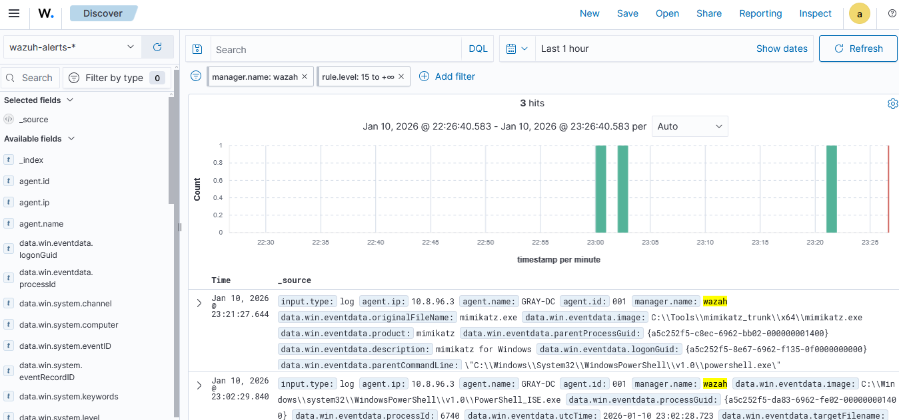
*Wazuh dashboard displaying the Level 15 alert for Mimikatz, confirming the success of the detection pipeline.*

### 🧰 Technical Skills Demonstrated
* **Cloud Security:** Migration from Public IP whitelisting to Private VPC segmentation.
* **Network Troubleshooting:** Resolution of UDP port conflicts and service dependency management.
* **VPC Implementation:** Migration from public-facing assets to private-network-only management.
* **SIEM/EDR:** Integration of Sysmon with Wazuh and custom rule-set tuning (OSSEC).
